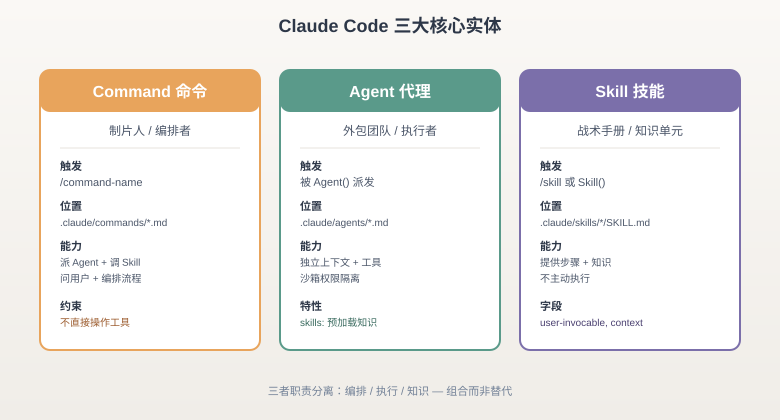
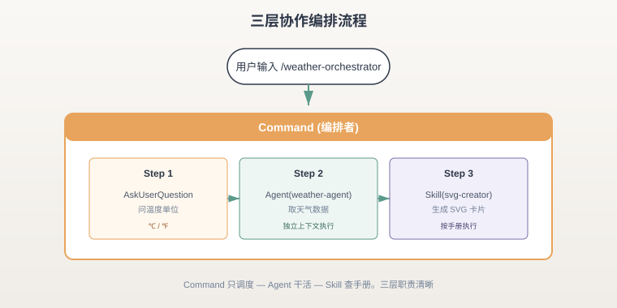
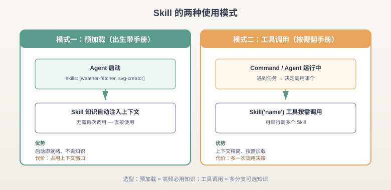
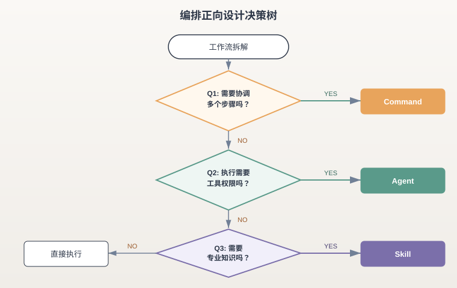
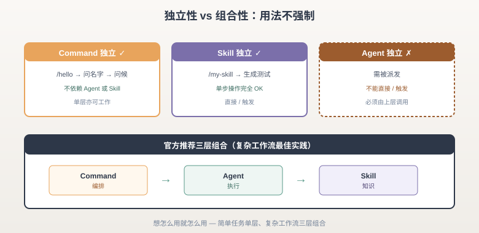
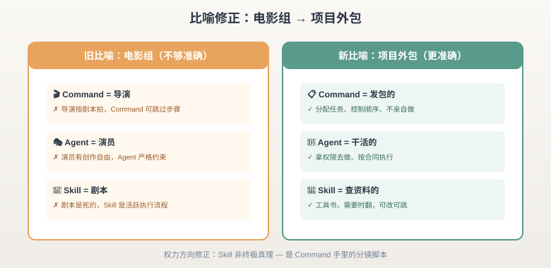
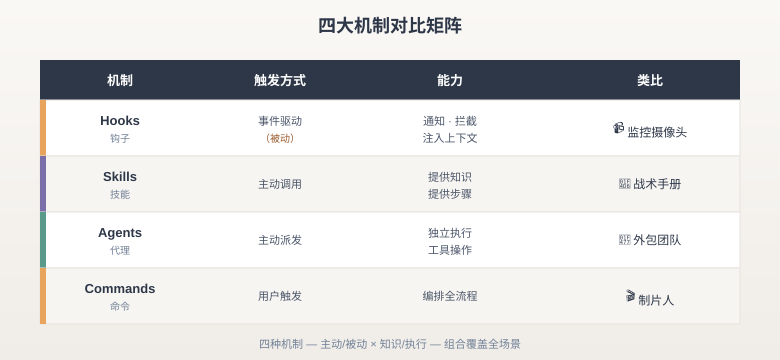
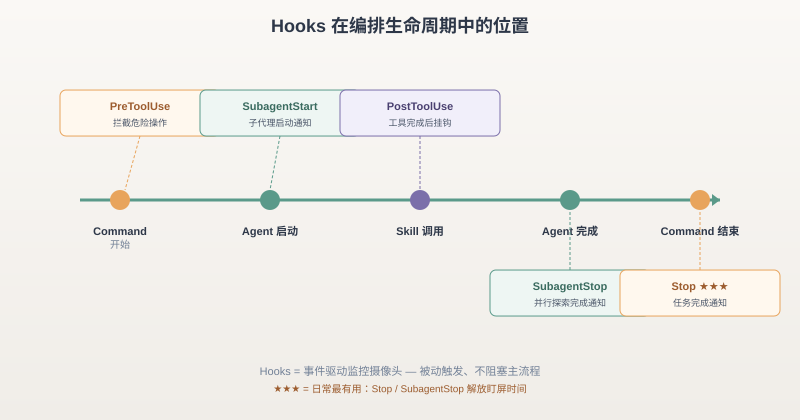

# Claude Code 编排体系 — 速读笔记

一句话先甩出来：**Command 派活，Agent 干活，Skill 查手册，Hook 当摄像头。** 四者职责分离、可独立可组合，官方不强制怎么用。



---

## 一、三大核心实体

### 1️⃣ Command（命令）— 制片人 / 总策划

- 📁 **位置**：`.claude/commands/*.md`
- 🚀 **触发**：用户输入 `/command-name`
- 💡 **本质**：流程入口点，纯调度层
- 🎬 **类比**：制片人 / 总策划 — 不干活，只分配任务

```yaml
# .claude/commands/weather-orchestrator.md
---
description: Fetch Dubai weather and create an SVG weather card
model: haiku
allowed-tools:
  - AskUserQuestion
  - Agent
  - Skill
---
```

⚠️ **关键约束**：Command 设计上**不直接操作工具**（无 Read/Bash/Write），只能派发 Agent 和调用 Skill。这是架构偏好，不是技术限制 — 想让它干活？派 Agent 去。

---

### 2️⃣ Agent（代理）— 外包团队

- 📁 **位置**：`.claude/agents/*.md`
- 🚀 **触发**：被 Command 或其他 Agent 通过 `Agent()` 工具派发
- 💡 **本质**：有工具权限的执行者，独立上下文
- 👷 **类比**：外包团队 — 有权限、去干活、按约束执行

```yaml
# .claude/agents/weather-agent.md
---
name: weather-agent
description: Fetches weather data
skills:
  - weather-fetcher          # 预加载 Skill
allowed-tools:
  - Read
  - Skill
---
```

🔑 **关键特性**：
- `allowed-tools` 控制权限边界（沙箱）
- `skills:` 字段预加载知识（出生带手册）
- 启动时创建全新上下文，**不污染主会话**
- 没有创作自由，严格按约束执行

---

### 3️⃣ Skill（技能）— 战术手册

- 📁 **位置**：`.claude/skills/<name>/SKILL.md`
- 🚀 **触发**：`/skill-name` 直接调用，或被 `Skill()` 工具调用
- 💡 **本质**：知识单元 / 操作手册 — 提供步骤，不主动执行
- 📖 **类比**：战术手册 — 需要时翻出来指导

```yaml
# .claude/skills/weather-fetcher/SKILL.md
---
name: weather-fetcher
description: Fetch temperature from Open-Meteo
user-invocable: false       # 禁止 / 直接调用
---
```

🔑 **关键字段速查**：
- `user-invocable: false` → 只能通过 `Skill()` 工具调用
- `user-invocable: true`（默认）→ 可以用 `/skill-name` 直接调用
- `disable-model-invocation: true` → 阻止自动调用
- `context: fork` → 在隔离子代理中运行
- `allowed-tools` → Skill 激活时免确认的工具列表

---

## 二、编排模式：三层协作怎么跑



走一遍完整流程：用户敲 `/weather-orchestrator` → Command 接管 → 第一步用 `AskUserQuestion` 问温度单位 → 第二步派 `weather-agent` 取数据 → 第三步调 `weather-svg-creator` 生成 SVG 卡片。**Command 自己不动手，全程只调度。**

---

### 🎯 Skill 的两种使用模式（很多人搞混）



| 模式 | 机制 | 适用场景 |
|------|------|----------|
| **预加载** | Agent 的 `skills:` 字段 | Agent 启动时自动注入上下文，**出生就带手册** |
| **工具调用** | `Skill()` 工具 | 运行时按需调用，**可调多个 Skill** |

💡 **取舍**：预加载启动即就绪、不丢知识，但**占用上下文窗口**；工具调用上下文精简、按需加载，但**多一次决策**。高频必用就预加载，多分支可选就工具调用。

---

### 🌳 正向设计决策树



三问搞定整个工作流拆解：

1. **Q1：需要协调多个步骤吗？**
   - YES → **Command**（编排层）
   - NO → 继续问 Q2
2. **Q2：执行时需要工具权限吗？**
   - YES → **Agent**（给工具、带去干活）
   - NO → 继续问 Q3
3. **Q3：执行时需要专业知识吗？**
   - YES → **Skill**（操作手册）
   - NO → **直接执行**

---

### ⚡ 快速决策 Checklist

| 条件 | 选择 |
|------|------|
| 需要问用户问题 | Command |
| 需要派多个任务并行 | Agent |
| 需要控制工具权限 | Agent |
| 需要封装专业知识/步骤 | Skill |
| 需要组合多个 Skill | Command |
| 需要在 Agent 启动时自动加载知识 | Agent + `skills:` 预加载 |
| 需要运行时动态选 Skill | Command + `Skill` 工具 |

---

## 三、独立性 vs 组合性 — 别被官方架构忽悠死



### 🧱 三者都可以独立使用

| 实体 | 独立使用 | 例子 |
|------|----------|------|
| Command | ✅ 直接 `/hello` | 问名字 + 回答问候 |
| Skill | ✅ 直接 `/my-skill` | 单步操作如生成测试 |
| Agent | ❌ 需要被派发 | 不能直接 `/` 触发 |

### 🎯 官方架构是推荐实践，不是强制约束

- **三层编排** = 复杂工作流最佳实践
- **单 Skill** = 简单任务完全 OK
- **单 Command** = 不依赖 Agent/Skill 也能工作
- **想怎么用就怎么用，官方不限制**

---

## 四、比哈批判：电影比喻的修正



| 比喻 | 贴切处 | 不贴切处 |
|------|--------|----------|
| Command = 导演 | 不亲自演戏，调度全局 | 导演按剧本拍，Command **可以跳过步骤** |
| Agent = 演员 | 实际执行 | 演员有创作自由，Agent **严格约束** |
| Skill = 剧本 | 提供知识 | 剧本是死的，Skill **是活跃执行流程** |

✅ **更准确比喻**：Command = **发包的**，Agent = **干活的**，Skill = **查资料的**。

⚠️ **权力方向修正**：Skill 不是"终极真理"，而是被 Command 调用的工具。更像导演手里的分镜脚本 — **可以改、可以跳过**。这点很重要 — 别把 Skill 当圣经，它只是知识库。

---

## 五、Hooks 与编排体系的关系

### 🎛️ 四大机制全景对比



| 机制 | 触发方式 | 能力 | 类比 |
|------|----------|------|------|
| **Hooks** | 事件驱动（被动） | 通知、拦截、注入上下文 | 📹 监控摄像头 |
| **Skills** | 主动调用 | 提供知识、步骤 | 📖 战术手册 |
| **Agents** | 主动派发 | 独立执行、工具操作 | 👷 外包团队 |
| **Commands** | 用户触发 | 编排全流程 | 🎬 制片人 |

### 🔌 Hook 在编排中的位置



走一遍 Command 编排流程的钩子触发链：

- 触发 **PreToolUse Hook** → 可拦截危险操作
- Agent 执行 → 触发 **SubagentStart Hook**
- Agent 完成 → 触发 **SubagentStop Hook**
- Skill 调用 → 触发 **PostToolUse Hook**
- Command 结束 → 触发 **Stop Hook**

### 🏆 最有价值的 Hook（按日常使用排序）

| 优先级 | Hook | 原因 |
|--------|------|------|
| ★★★ | **Stop** | 任务完成通知，**不用盯屏幕** |
| ★★★ | **SubagentStop** | 并行探索完成通知 |
| ★★☆ | **PreToolUse** | 拦截危险操作 |
| ★★☆ | **PermissionRequest** | 自动放行安全命令 |
| ★☆☆ | **PreCompact** | 压缩前保存关键信息 |

---

## 六、决策卡汇总（揣兜里）

### 🎬 Command

| 问题 | 答案 |
|------|------|
| **何时用** | 需要协调多步骤、需要用户输入、需要组合 Agent/Skill |
| **何时不用** | 单步操作、简单查询 |
| **关键取舍** | 编排层数 ↑ = 灵活但复杂 |

### 👷 Agent

| 问题 | 答案 |
|------|------|
| **何时用** | 需要工具权限、需要并行执行、需要权限隔离 |
| **何时不用** | 只提供知识、不需要执行操作 |
| **关键取舍** | 多 Agent = 权限隔离好但**上下文开销大** |

### 📖 Skill

| 问题 | 答案 |
|------|------|
| **何时用** | 封装可复用知识/步骤、提供专业指导 |
| **何时不用** | 需要直接执行操作、需要工具权限 |
| **关键取舍** | 预加载 = 快但占上下文；工具调用 = 按需但多一步 |

### 📹 Hooks

| 问题 | 答案 |
|------|------|
| **何时用** | 状态感知、外部联动、重复通知、拦截危险操作 |
| **何时不用** | 需要决策的逻辑、阻塞性操作 |
| **关键取舍** | 异步优先 → 不影响主流程；匹配器过滤 → 减少噪音 |

### 🔁 StopFailure Hook（API 重试）

| 问题 | 答案 |
|------|------|
| **何时用** | 第三方 API 不返回标准 Anthropic 错误格式时 |
| **何时不用** | 官方 API（内置重试已覆盖） |
| **关键取舍** | additionalContext 注入 = 间接提示，**非强制重试** |

---

## 💎 全文一句话收尾

> **Command 派活，Agent 干活，Skill 查手册，Hook 当摄像头。**
> 简单任务单层、复杂工作流三层组合，Hook 当探针。
> 别再用导演/演员比喻了 — 记住：**发包的 + 干活的 + 查资料的**。
